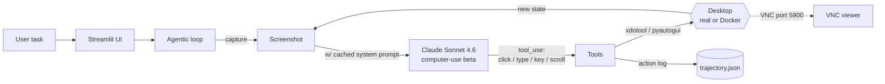

# Computer Use Agent — Claude Sees Your Screen and Drives the Mouse

> **A minimal, production-shape harness around Anthropic's `computer-use-2024-10-22` beta: Streamlit UI, screenshot → Claude → tool_use → dispatch loop, image pruning to stay under the context window, prompt caching to keep the bill flat, and a Docker + VNC sandbox so it can't nuke your real desktop.**

<p align="center"></p>

<p align="center">
  
  
  
  
  
</p>

## Why this exists

Anthropic shipped `computer-use` and every demo I found either (a) drove the host machine with zero isolation (goodbye, browser tabs) or (b) buried the loop in 2000 lines of framework code. This repo is the smallest useful thing: one Streamlit UI, one agent loop, one Docker sandbox with Xvfb + x11vnc + Firefox ESR that you can watch over VNC on `localhost:5900`. Every action lands in `trajectory.json` so you can replay a session, and image pruning + prompt caching keep long tasks under the context window and under budget.

## Try it in 60 seconds — Docker sandbox (recommended)

```bash
git clone https://github.com/Danush-Aries/computer-use-agent.git
cd computer-use-agent

cp .env.example .env                # add ANTHROPIC_API_KEY
docker compose up --build

# Streamlit UI  → http://localhost:8501
# VNC viewer    → localhost:5900     (no password) — watch Claude live
```

Demo mode (drives your **real** desktop via pyautogui — use with care):
```bash
python3 -m venv .venv && source .venv/bin/activate
pip install -r requirements.txt
streamlit run app.py
```

## How it works

- **Agent loop (`agent/computer_use_agent.py`)** — screenshot → Claude Sonnet 4.6 with `computer-use` beta → parse `tool_use` blocks → dispatch to `tools.py` → new screenshot → repeat. Terminates when Claude returns a message with no tool call.
- **Image pruning (`agent/image_utils.py`)** — keeps only the last 3 screenshots in context. Older frames are dropped; text tool results are retained so Claude keeps state without blowing the window.
- **Prompt caching** — system prompt flagged `cache_control: ephemeral`, so a 10-minute task doesn't pay for the setup message on every turn.
- **Trajectory recorder (`agent/trajectory.py`)** — every `{timestamp, action, params, result}` appended to `trajectory.json`. Great for replay, unit tests, and debugging "why did it click there".
- **Two backends, one interface** — `DOCKER_MODE=true` uses `xdotool` + `scrot` inside the container's Xvfb display; `DOCKER_MODE=false` uses `pyautogui` on your real desktop. Same tool defs, same loop.



## Screenshots

| Streamlit UI | VNC into the Docker sandbox | Trajectory replay |
|---|---|---|
|  |  |  |

## Environment

| Variable | Default | Description |
|---|---|---|
| `ANTHROPIC_API_KEY` | — | Required |
| `DOCKER_MODE` | `false` | `true` → xdotool/scrot in Docker; `false` → pyautogui on real desktop |
| `DISPLAY` | `:99` | X display used in Docker mode |
| `SCREEN_WIDTH` | `1280` | Virtual display width (Docker) |
| `SCREEN_HEIGHT` | `800` | Virtual display height (Docker) |
| `VNC_PORT` | `5900` | VNC server port (Docker) |
| `STREAMLIT_PORT` | `8501` | Streamlit server port |

## Trajectory format

`trajectory.json` is a JSON array of action objects:

```json
[
  {
    "timestamp": 1718234567.123,
    "action": "left_click",
    "params": {"x": 640, "y": 400},
    "result": null
  }
]
```

## Project structure

```
computer-use-agent/
├── app.py                        # Streamlit UI
├── agent/
│   ├── computer_use_agent.py     # Main agentic loop + prompt caching
│   ├── tools.py                  # Computer-use tool defs & execution
│   ├── image_utils.py            # Screenshot capture + image pruning
│   └── trajectory.py             # Action recorder → trajectory.json
├── Dockerfile                    # Ubuntu + Xvfb + x11vnc + Firefox
├── docker-compose.yml
├── docker-entrypoint.sh
├── requirements.txt
└── .env.example
```

## Stack

Python 3.11+ · `anthropic>=0.40.0` (with `computer-use-2024-10-22` beta) · `streamlit>=1.32.0` · `Pillow>=10.0.0` · `pyautogui>=0.9.54` (demo) · `xdotool` + `scrot` (Docker) · Docker + Compose · Xvfb + x11vnc + Firefox ESR (sandbox).

## Contributing

PRs welcome. New tools implement one function in `agent/tools.py` matching Anthropic's tool schema; the loop dispatches automatically. Add trajectory analysers (heatmap, action histogram, failure clustering) in `agent/trajectory.py`.

## License

MIT — see [LICENSE](./LICENSE).

---

### More from Danush

- [ponytail-for-python](https://github.com/Danush-Aries/ponytail-for-python) — code intelligence for Python codebases
- [Agentic_Systems](https://github.com/Danush-Aries/Agentic_Systems) — reference implementations of agent patterns
- [autonomous-coding-agent](https://github.com/Danush-Aries/autonomous-coding-agent) — full-auto engineering agent
- [computer-use-agent](https://github.com/Danush-Aries/computer-use-agent) — Claude drives your desktop via VNC
- [browser-automation-agent](https://github.com/Danush-Aries/browser-automation-agent) — Claude drives Playwright
- [blinkchat](https://github.com/Danush-Aries/blinkchat) — realtime chat with vibes
