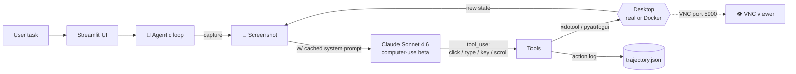

<div align="center">
  
</div>

<div align="center">


</div>

A desktop-control agent powered by **Claude Sonnet 4.6** and Anthropic's `computer-use-2024-10-22` beta. The agent **sees** your screen via screenshots, **plans** actions, and **drives** mouse and keyboard — through a clean Streamlit UI, with a Docker + VNC sandbox so it can't break your real desktop.

## 🏗️ How it works



## ✨ Features

- 🤖 **Agentic loop** — screenshot → Claude → tool execution → repeat until done
- 💸 **Prompt caching** — system prompt flagged `cache_control: ephemeral` for low-cost long tasks
- 🖼️ **Image pruning** — keeps only the last 3 screenshots in context (stays under the window)
- 📼 **Trajectory recording** — every action appended to `trajectory.json` for replay / debugging
- 🛡️ **Docker sandbox** — Ubuntu + Xvfb + x11vnc + Firefox ESR; watch via VNC

---

## 🚀 Quick start (demo mode, real desktop)

```bash
git clone https://github.com/Dhanush-Aries/computer-use-agent.git
cd computer-use-agent

python3 -m venv .venv && source .venv/bin/activate
pip install -r requirements.txt

cp .env.example .env                # add ANTHROPIC_API_KEY
streamlit run app.py                # http://localhost:8501
```

> ⚠️ **Demo mode** (`DOCKER_MODE=false`) drives your **real desktop** via pyautogui. Use the Docker sandbox below for safety.

---

## 🐳 Docker sandbox

```bash
cp .env.example .env                # add ANTHROPIC_API_KEY
docker compose up --build

# Streamlit UI  → http://localhost:8501
# VNC viewer    → localhost:5900     (no password)
```

The container runs an Xvfb virtual display (1280×800) with Firefox ESR. Point a VNC client at `localhost:5900` to watch the agent in real time.

---

## 📂 Project structure

```
computer-use-agent/
├── app.py                        # Streamlit UI
├── agent/
│   ├── computer_use_agent.py     # Main agentic loop + prompt caching
│   ├── tools.py                  # Computer-use tool defs & execution
│   ├── image_utils.py            # Screenshot capture + image pruning
│   └── trajectory.py             # Action recorder → trajectory.json
├── Dockerfile                    # Ubuntu + Xvfb + x11vnc + Firefox
├── docker-compose.yml
├── docker-entrypoint.sh
├── requirements.txt
└── .env.example
```

---

## ⚙️ Environment

| Variable | Default | Description |
|---|---|---|
| `ANTHROPIC_API_KEY` | — | **Required.** |
| `DOCKER_MODE` | `false` | `true` → xdotool/scrot in Docker; `false` → pyautogui on real desktop |
| `DISPLAY` | `:99` | X display used in Docker mode |
| `SCREEN_WIDTH` | `1280` | Virtual display width (Docker) |
| `SCREEN_HEIGHT` | `800` | Virtual display height (Docker) |
| `VNC_PORT` | `5900` | VNC server port (Docker) |
| `STREAMLIT_PORT` | `8501` | Streamlit server port |

---

## 📼 Trajectory format

`trajectory.json` is a JSON array of action objects:

```json
[
  {
    "timestamp": 1718234567.123,
    "action": "left_click",
    "params": {"x": 640, "y": 400},
    "result": null
  }
]
```

---

## ⚙️ Requirements

Python 3.11+ · `anthropic>=0.40.0` · `streamlit>=1.32.0` · `Pillow>=10.0.0` · `pyautogui>=0.9.54` (demo) · `python-dotenv>=1.0.0` · Docker + Compose (sandbox)

## 📜 License

MIT — see [LICENSE](./LICENSE)

---

<sub>Part of the <a href="https://github.com/Dhanush-Aries">Dhanush Shankar</a> AI engineering portfolio.</sub>
